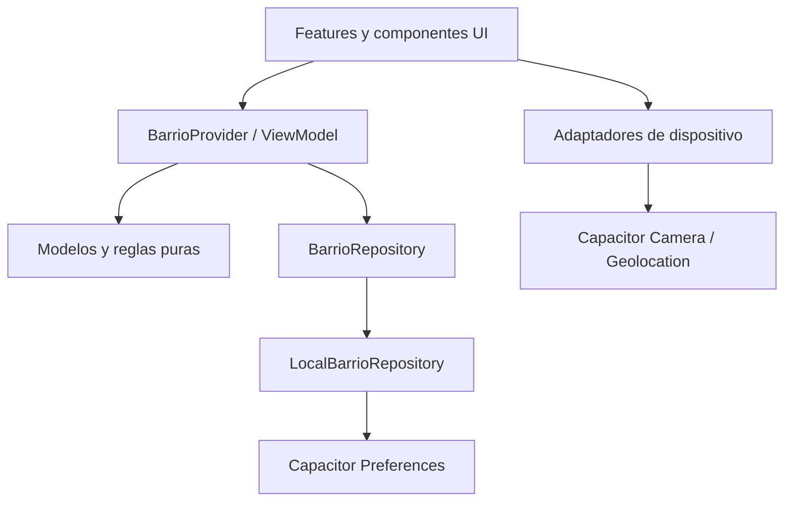
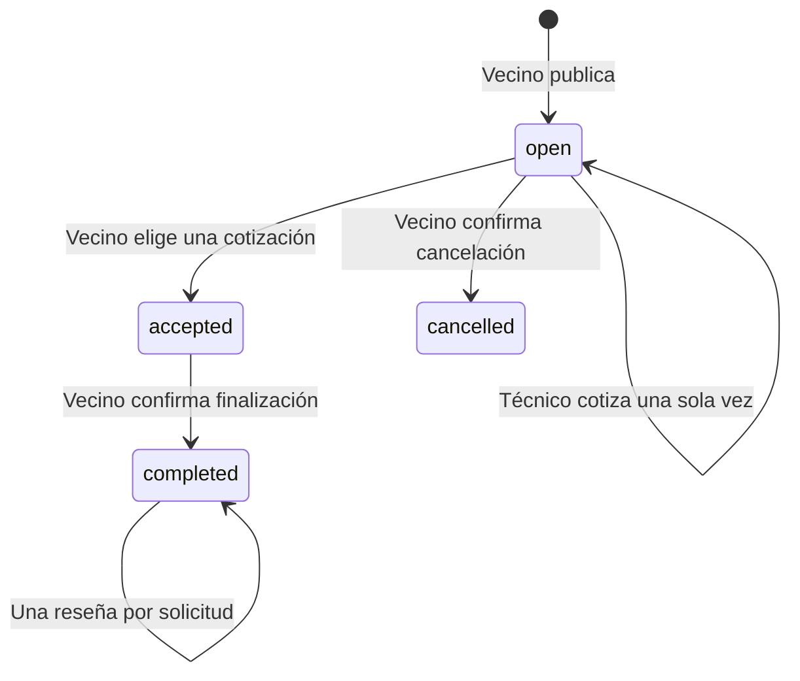

# Arquitectura y trazabilidad

## Decisión tecnológica

El usuario pidió Ionic y soporte compartido para Android y Apple. Esta decisión sustituye la alternativa Flutter/React Native y la prioridad exclusiva de Android descritas en el documento fuente. Las notas del PDF sobre entregar bocetos en otro PDF no forman parte de la solicitud de desarrollo: aquí se entregan pantallas ejecutables.

Ionic React aporta la base de componentes y contenedores móviles; Capacitor integra los proyectos nativos y las APIs de dispositivo. TypeScript define contratos de dominio y Vite produce los recursos compartidos. La interfaz se diseña con CSS propio y componentes Ionic para mantener una identidad visual reconocible.

## Flujo de dependencias

- **View:** pantallas, formularios, navegación y accesibilidad. Los campos conservan su estado de edición local; no acceden directamente a la base.
- **ViewModel:** valida las acciones y los cambios de estado, coordina el repositorio, expone estado y mensajes. Las transacciones en cola evitan perder cambios por clics cercanos.
- **Domain:** entidades y funciones independientes de React, evaluables con pruebas unitarias.
- **Data:** carga y guarda un documento versionado. Los datos iniciales son una fuente explícita de demostración.
- **Platform:** permisos de geolocalización bajo demanda, cámara nativa y compresión de imágenes seleccionadas.

No se almacenan contraseñas ni se presenta un formulario de autenticación falso. El rol local sirve para probar las dos experiencias y no constituye un control de acceso seguro.

## Máquina de estados de una solicitud

Una solicitud aceptada deja de recibir cotizaciones. Las cancelaciones del prototipo se limitan a solicitudes abiertas; cancelaciones posteriores, disputas y reembolsos necesitan reglas explícitas de producto. Los técnicos ven solicitudes de su categoría y aquellas que han cotizado.

## Correspondencia con el PDF

| Requisito               | Implementación                                                   | Límite                                                          |
| ----------------------- | ---------------------------------------------------------------- | --------------------------------------------------------------- |
| RF01 Registro y sesión  | Perfil local con dos roles                                       | Autenticación por correo/OAuth pendiente de backend             |
| RF02 GPS y radio        | Capacitor Geolocation, Haversine y selector de radio             | Sin seguimiento en segundo plano; GPS requiere permiso          |
| RF03 Perfil profesional | Oficio, descripción, zona, teléfono y cuatro fotos               | El perfil local no tiene verificación de identidad              |
| RF04 Solicitud exprés   | Validación, fotografía, urgencia y zona aproximada               | Persistencia en un solo dispositivo                             |
| RF05 Push por cercanía  | Bandeja local y contador de solicitudes con respuesta            | No se envían push; requiere backend, FCM/APNs y credenciales    |
| RF06 Filtros            | Categoría, nombre/barrio, distancia, puntuación y disponibilidad | Catálogo de prueba más perfil técnico local                     |
| RF07 Reseñas            | 1–5 estrellas y comentario, tras finalizar un trabajo            | Reglas del cliente; deben repetirse en servidor para producción |
| Contacto directo        | `tel:` y `https://wa.me/` con teléfono del perfil local          | Los perfiles ficticios no llaman a personas reales              |
| Caché offline           | Preferences y aviso de desconexión                               | Mapa/fuentes requieren red; navegador sin service worker        |
| Privacidad              | GPS exacto en memoria y coordenadas públicas redondeadas a 0,01° | Esto reduce precisión, no garantiza anonimato absoluto          |
| Android/iOS             | Proyectos Capacitor, permisos y recursos compartidos             | Sin compilación/firma de distribución en esta entrega           |
| Rendimiento 2,5 s       | Filtrado local, carga diferida de mapa/pantallas                 | No se certifica el objetivo en 4G o dispositivos físicos        |

## Escalabilidad

1. Mantener entidades y reglas en `domain`; mover nuevos casos de uso a archivos por función cuando crezca el ViewModel.
2. Introducir repositorios por agregado (`TechnicianRepository`, `RequestRepository`, `ProfileRepository`) con operaciones paginadas y mutaciones atómicas. La interfaz `load/save` actual es para un snapshot local; no debe trasladarse como escritura completa a una base multiusuario.
3. Conectar autenticación real antes de guardar información privada en un servidor. El servidor debe derivar actor y permisos del token; nunca confiar en el rol elegido por la UI.
4. Reemplazar la fuente demo por consultas geoespaciales indexadas y cargar imágenes desde almacenamiento con URLs temporales cuando sean privadas.
5. Sustituir fotos base64 en Preferences por archivos o SQLite para operación sin conexión a mayor escala. Incorporar migraciones de versión y estrategias de conflictos.
6. Añadir notificaciones mediante eventos después de confirmar la transacción, con geofencing en servidor, deduplicación e idempotencia.

El MVP no almacena ubicación en segundo plano. El rol técnico de prueba usa la zona de exploración actual como punto local; una cuenta real deberá registrar su área de cobertura por separado.

## Verificación

- Unitarias: distancia, normalización de búsqueda, combinación de filtros, privacidad de coordenadas, requisitos de solicitudes y cálculo de reputación.
- E2E en 1440×1100 y 390×844: favoritos persistentes, filtros, mapa y acceso a perfiles, creación/aceptación/finalización/reseña y edición de rol técnico.
- Compilación TypeScript y Vite, sincronización Capacitor y revisión visual de capturas.
- Pendiente en entorno de distribución: emuladores/dispositivos, permisos del sistema, lectores de pantalla nativos, pruebas de 4G, firma y revisión de tienda.
